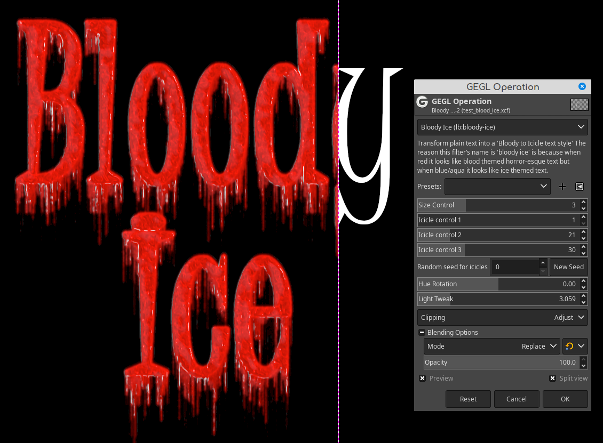
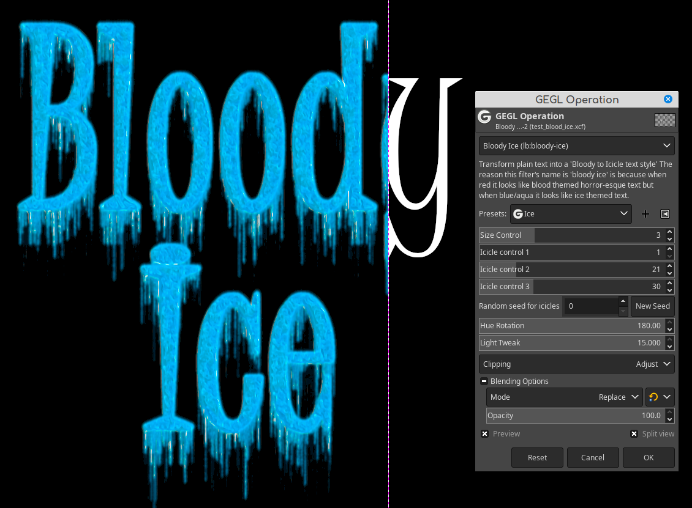

Blood or Ice Text. A Gegl / Gimp Plugin that renders Blood or Ice Text. This plugin is very resource intensive and may not 
work well on low spec machines.





## Location to put Binaries


### Windows
 C:\Users\(USERNAME)\AppData\Local\gegl-0.4\plug-ins
 
### Linux 
 /home/(USERNAME)/.local/share/gegl-0.4/plug-ins
 
### Linux (Flatpak includes Chromebook)
 /home/(USERNAME)/.var/app/org.gimp.GIMP/data/gegl-0.4/plug-ins


## Compiling and Installing

### Linux

To compile and install you will need the GEGL header files (`libgegl-dev` on
Debian based distributions or `gegl` on Arch Linux) and meson (`meson` on
most distributions).

```bash
meson setup --buildtype=release build
ninja -C build

```

If you have an older version of gegl you may need to copy to `~/.local/share/gegl-0.3/plug-ins`
instead (on Ubuntu 18.04 for example).

Dev recommends you use a modern version of GEGL. no guarantee dated versions of Gimp will work with this plugin.
Evidence seems to suggest that versions of Gimp before early 2020 will not proper with this plugin, meaning it may
run on them but run incorrectly with missing commands. 

### Windows

The easiest way to compile this project on Windows is by using msys2.  Download
and install it from here: https://www.msys2.org/

Open a msys2 terminal with `C:\msys64\mingw64.exe`.  Run the following to
install required build dependencies:

```bash
pacman --noconfirm -S base-devel mingw-w64-x86_64-toolchain mingw-w64-x86_64-meson mingw-w64-x86_64-gegl
```

Then build the same way you would on Linux:

```bash
meson setup --buildtype=release build
ninja -C build
```

Have fun BTFO-ing Adobe users

